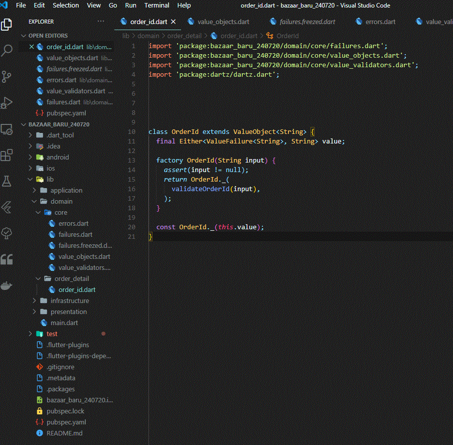

# BB Apps

The unfinished attempt on designing food delivery app.

## Adobe XD sketch

File can be found inside folder bazaarBaru_app_01_sketch 

## Code Flowchart

Code are divided into 4 layers - Presentation, Application, Domain, Infrastructure.

[Link to edit ](https://app.diagrams.net/#G1vWPleFIhvBRUEWxAKbuykW6ZEUJWsvwA)

Inspired by [Resocoder Domain Drive Design architecture](https://github.com/ResoCoder/flutter-ddd-firebase-course)

## Code (Flutter)
Inspired by [Resocoder Domain Drive Design](https://github.com/ResoCoder/finished-flutter-firebase-ddd-course)

A very limited progress made on Entity OrderId. 

